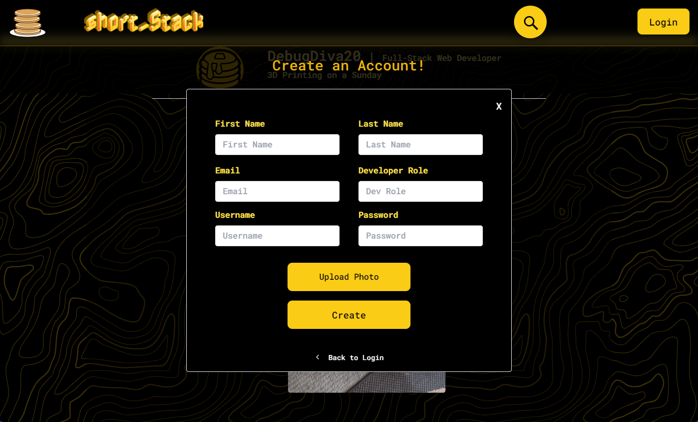
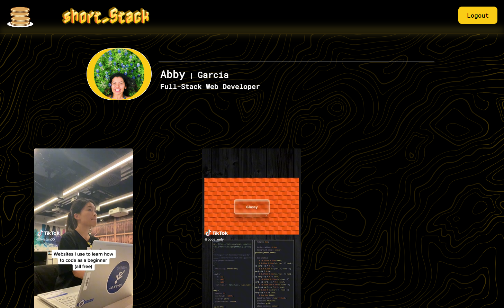

# Short Stack

## Description
Short Stack is a social platform that caters to developers or anyone in the tech community, providing them with a space to share short-form videos on tech insights and interesting techniques. Our motivation for creating "Short Stack" was to encourage users to share valuable, short videos that others can learn from. Additionally, users are able to create their own accounts where they can connect with other users and share their passion for technology and development. 

## Table of Contents 
 * [Installation](#installation)
 * [Usage](#usage)
 * [Credits](#credits)
 * [License](#license)
 * [Questions](#questions)

 ## Installation

Clone the repository. Install all required dependencies using: npm i. Once installed, type 'npm run start' into the terminal. A window on your browser will open allowing you to view the app on your computer as localhost.

 ## Usage

https://github.com/KodaCaleb/ShortStack.git

 This app is intended for developers looking to share short-form videos that are coding related. Users can view random videos on the homepage, or they can join the community by creating a profile. Members can search for videos on specific topics or can upload their own videos for others to view, like, and learn from.

## Credits
- https://tailwindcss.com/
- https://firebase.google.com/docs/firestore
- https://www.tiktok.com/en/
- https://react.dev/
- https://stackoverflow.com/
- Andrea Presto (TA)

## License
This app is licensed under the MIT license.

## Questions
Questions about this app?  
- GitHub: https://github.com/kodaCaleb
- GitHub: https://github.com/abigailmgarcia
- GitHub: https://github.com/cjsolis12  
- GitHub: https://github.com/joaqsala 
- GitHub: https://github.com/csullins
- GitHub: https://github.com/Jstanion